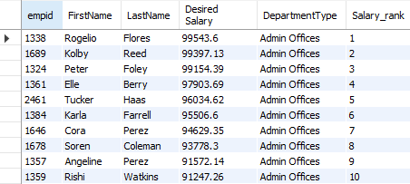
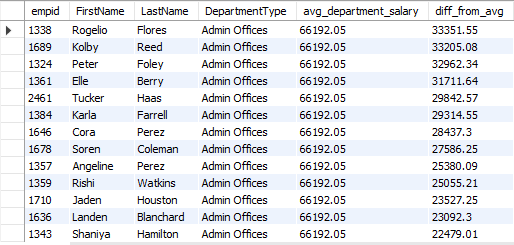
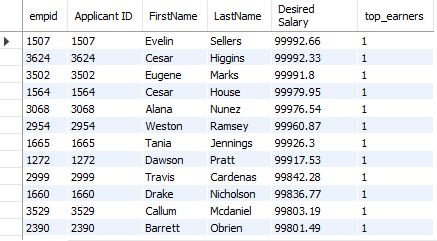
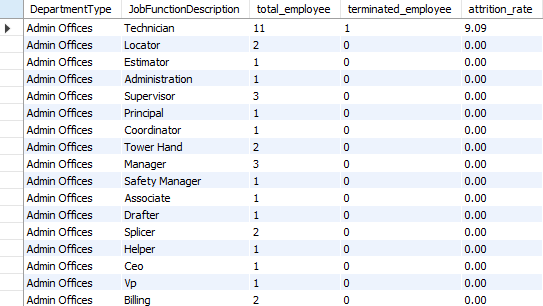
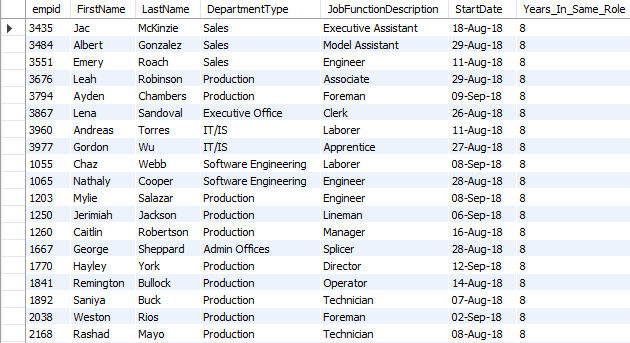
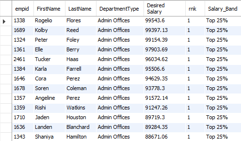

# sql-hr-analytics-project
Employee Salary &amp; Attrition Analysis using SQL Window Functions (ROW_NUMBER, RANK, NTILE, AVG OVER) - Real-world HR analytics project 

## What the Project Does

This project analyzes employee data using SQL to identify salary patterns, employee attrition, salary differences across departments, employee tenure, and salary distribution.

The analysis uses SQL Window Functions such as `ROW_NUMBER()`, `AVG() OVER()`, and `NTILE()` to answer important HR and business questions from the employee and recruitment data.

## Business Problems Solved

The project focuses on the following business problems:

- **Salary Ranking:** Identify employees with the highest desired salary within each department.
- **Salary Comparison:** Compare each employee's desired salary with the average salary of their department.
- **Top Earners:** Identify employees who fall within the top 10% based on desired salary.
- **Employee Attrition:** Analyze attrition rates across departments and job types to identify areas with higher employee turnover.
- **Employee Tenure:** Identify current employees who have spent 5 or more years in the same role.
- **Salary Distribution:** Categorize employees into salary bands within each department to understand salary distribution.

These insights can help HR teams and management better understand employee compensation, retention, workforce distribution, and potential areas requiring further analysis.

## Key SQL Analysis

### 1. Rank Employees by Desired Salary Within Each Department

**Business Question:**  
Who are the employees with the highest desired salary in each department?

**SQL Query:** [View SQL Query](queries/1_rank_by_salary.sql)

**What it answers:**  
Ranks employees within each department based on their desired salary using the `ROW_NUMBER()` window function.

**Sample Result:**

---

### 2. Compare Employee Desired Salary with Department Average

**Business Question:**  
How does each employee's desired salary compare with the average desired salary of their department?

**SQL Query:** [View SQL Query](queries/2_avg_salary_comparison.sql)

**What it answers:**  
Calculates the average desired salary for each department and shows how much each employee's desired salary differs from that department average.

**Sample Result:**

---

### 3. Identify the Top 10% Earners

**Business Question:**  
Which employees fall within the top 10% based on desired salary across the company?

**SQL Query:** [View SQL Query](queries/3_top_10_percent.sql)

**What it answers:**  
Uses the `NTILE(10)` window function to divide employees into ten salary groups and identifies employees in the highest salary group.

**Sample Result:**

---

### 4. Analyze Attrition Rate by Department and Job Type

**Business Question:**  
Which departments and job types have the highest employee attrition?

**SQL Query:** [View SQL Query](queries/4_attrition_rate.sql)

**What it answers:**  
Calculates the total number of employees, terminated employees, and attrition rate for each department and job function.

**Sample Result:**

---

### 5. Identify Employees with 5+ Years in the Same Role

**Business Question:**  
Which current employees have been in the same role for five or more years?

**SQL Query:** [View SQL Query](queries/5_long_tenure.sql)

**What it answers:**  
Calculates the number of years employees have been in their current role and identifies employees with at least five years of tenure in that role.

**Sample Result:**

---

### 6. Categorize Employees into Salary Bands

**Business Question:**  
How are employees distributed across salary bands within each department?

**SQL Query:** [View SQL Query](queries/6_salary_quartiles.sql)

**What it answers:**  
Uses `NTILE(4)` to divide employees within each department into four salary groups: Top 25%, Upper Mid, Lower Mid, and Bottom 25%.

**Sample Result:**

